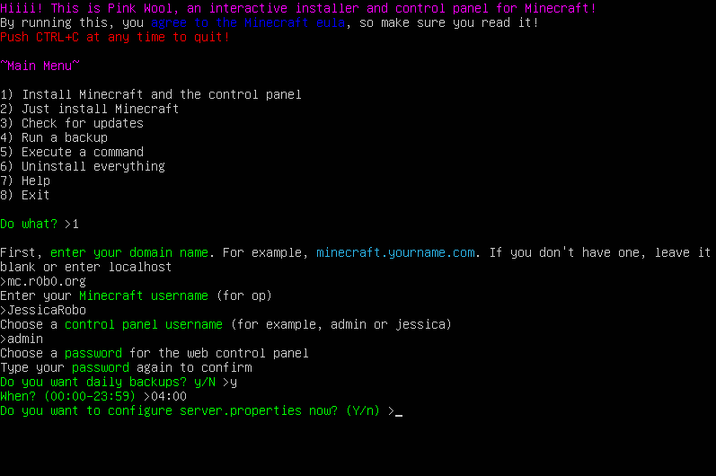
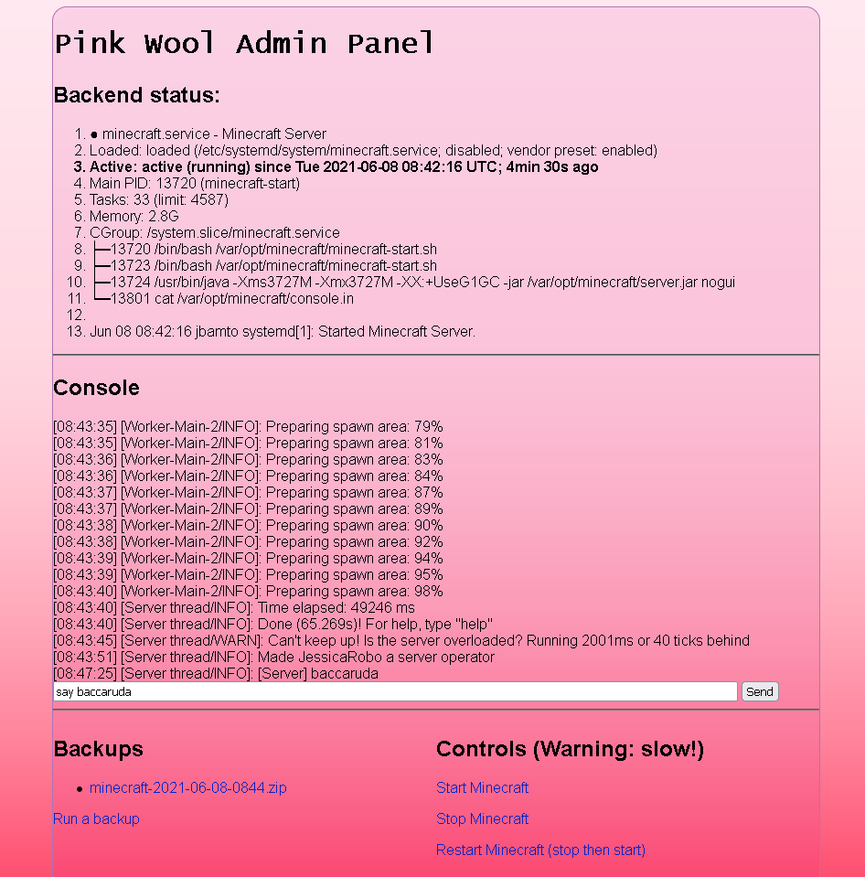

# Pink Wool
BASH installation script and simple control panel for Minecraft

This can:
- Install Minecraft as a service on a 64-bit Linux server
- Configure some of server.properties
- Create daily .zip backups
- Create a web-based control panel

The control panel is a [Caddy](https://caddyserver.com) HTTPS server hosting a few PHP files with basic auth. If you don't have a fully qualified domain name, your cert will be self-signed but functioning. The control panel gives you full access to Minecraft's console through the local server, so no `mcrcon` or `screen` is needed.

## When would I use this?
When:
- You have a Linux server with a supported distribution (currently apt-based, like Debian & Ubuntu)
- You plan to use it for (currently) **only** 1 Minecraft server and 
- You don't care if this script runs destructively, changing whatever it wants to change (apt/rpm, systemd, Caddy configuration, etc). In particular, this installer overwrites /var/opt/minecraft and /etc/caddy/Caddyfile

Tested and working on:
- Ubuntu 20.04 LTS (recommended)
- Ubuntu 21.04
- Mint 20.1
- Debian 10
- Debian 11

Won't work (yet) on:
- Linux distributions based on something other than APT
- Architectures other than 64-bit

Won't work (ever) on:
- Systems without bash
- Probably Windows

## Installation

You will need to be root for the installation.

`sudo -s`

`wget https://raw.githubusercontent.com/jessicarobo/pink-wool/main/pink-wool.sh -O - | bash`

For post-install configuration, most of the relevant files will be in `/var/opt/minecraft/`.

## Commands

pink-wool.sh COMMAND

- **install**: installs Minecraft and the Pink Wool control panel, and all dependencies like Java and Caddy
- **minecraft-only**: non-interactively installs Minecraft and a systemd service
- **uninstall**: deletes Pink Wool and the folder where it installed Minecraft
- **update**: checks for a new version for Pink Wool
- **start/stop/restart**: performs the requested action on Minecraft's systemd service
- **backup**: Saves the Minecraft folder as a .zip (works best if Minecraft is not running)
- **do "RCON COMMAND"**: sends a command to the Minecraft console! For example, `do "say hiiii"` or `do "op JessicaRobo"`
- **help**: help

Web control panel commands: start, stop, restart, backup, and a minecraft admin console.

## To-do

- tutorial video
- multiple version support
- even more control panel stuff (installing new versions, uninstalling, updating)
- implement (programmer word meaning "steal") xpaw's status php (maybe no longer needed)
- broader distro support (CentOS is weird)
- broader architecture support

## Changelog

### v1.0.0
- Semantic versioning (this is the update after v0.3)
- Modular design: instead of one large shell script with everything in it, the PHP/HTML/CSS is separated out
- Modular design: the installer fetches a shell script for the user's specific linux distribution
- Modular design: can upgrade itself over http
- Commandline arguments, e.g. exec, backup, uninstall
- Uses standard Linux named pipes, so no more mcrcon & greater security
- Now supports systems with curl instead of wget
- Broader operating system support (Debians)
- Console now visible in the control panel :)

### v0.3
- More consistent code style (e.g. camelCase variables)
- Web panel UI redesign
- More input validation in the installer
- Installer lets the user retry/quit/continue
- Installer understands server.properties defaults
- Installer has a lot of new cute colors!
- No longer leaves source .tar.gz or .deb files lying around

### v0.2
- Can force a backup at any time through the web panel
- Web panel shows partial server status
- Panel supports start and stop commands instead of just restart
- Installer supports [Paper](https://papermc.io)
- Downloads a binary release for mcrcon instead of compiling it, resulting in fewer dependencies
- Fixed a bug where op level wasn't being written to server properties
- Minecraft now launches with the same value for minimum and maximum heap size
- Downloads Java 16 instead of 11
- Tab indents instead of spaces 😼
- Generally more readable code
- Slightly less pink page background 🌸

### v0.1
- Initial version!
- Installs vanilla MC
- Installs a control panel with built-in HTTPS

## Contact
Please get in touch if you have comments 
- Jessica ^O^ https://r0b0.org
